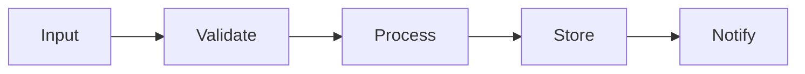
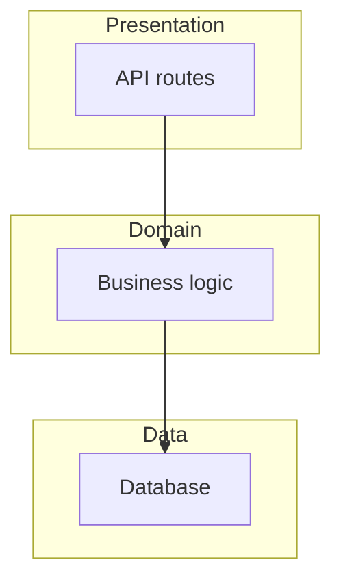
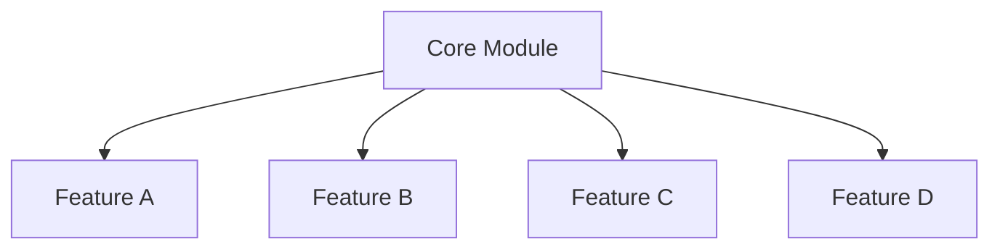
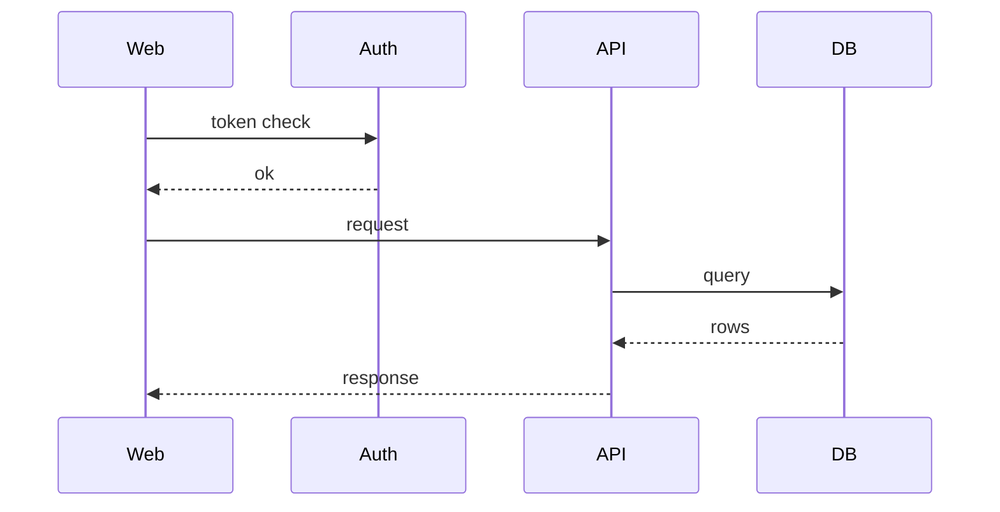
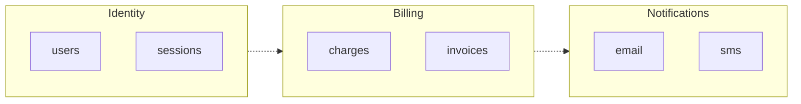

# Diagram Selection Rules

The lens shows exactly ONE Mermaid diagram. The script picks the shape automatically — this file documents how.

## Decision tree

```
1. Has CI/CD pipeline file + linear stages?           → pipeline
2. Has clear layers (api → domain → db)?               → layered
3. One central module imported by ≥ 50% of others?     → hub-spoke
4. Multiple services calling each other?                → sequence (service-to-service)
5. Monorepo with ≥ 5 top-level packages?               → domain-map
6. None of the above                                    → fallback: simple component list (no diagram)
```

## Shape signatures

### Pipeline



Trigger signals: stages-named modules (`ingest/`, `transform/`, `load/`), clear ordering in entry-point script, ETL/data-pipeline language in README.

### Layered



Trigger signals: directories named `api/`, `domain/` (or `core/`), `db/` (or `repository/`). Most common shape for web APIs.

### Hub-Spoke



Trigger signals: one module imported by majority of others (e.g., `utils/`, `core/`, `shared/`).

### Sequence (service-to-service)



Trigger signals: multiple `services/<name>/` or `apps/<name>/` directories with HTTP clients between them.

### Domain Map



Trigger signals: monorepo with ≥ 5 top-level domains. Each domain becomes a subgraph; cross-domain dependencies become dashed edges.

## Why one diagram only

Two diagrams force the reader to pick. One diagram, chosen well, means the reader looks at the right thing first. If users need more depth, the HTML supports a "drill-down" interaction on each node — but the *default view* is one shape only.

## Confidence

Each diagram is tagged in the lens with how confident the script was in the shape choice:

- ✅ Strong signal (≥ 3 trigger matches) — present as fact
- 🟡 Weak signal (1–2 trigger matches) — present with "looks like"
- 🔴 Forced fallback — present as "could not detect a clear shape; here is the module list instead"

The confidence tag appears under the diagram in small text.
